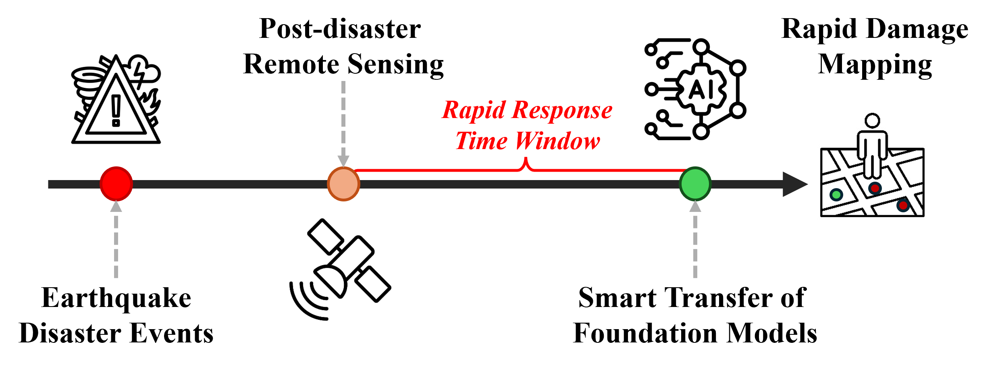
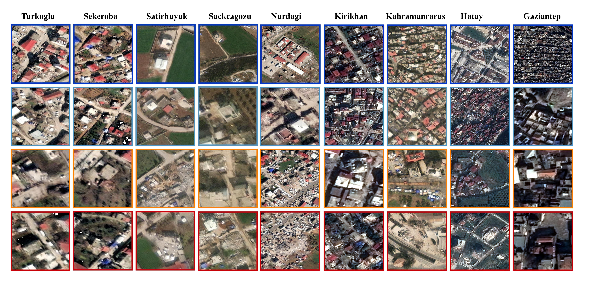
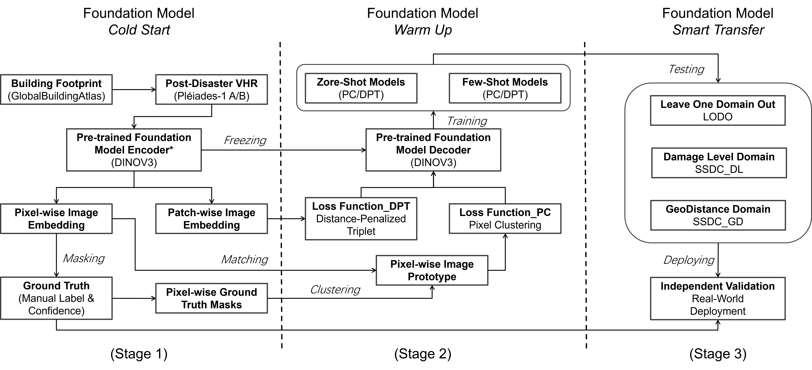

# Smart Transfer

### Smart Transfer: Leveraging Vision Foundation Models for Rapid Building Damage Mapping with Post-Earthquake VHR Imagery

In this paper, we introduce Smart Transfer, a novel Geospatial Artificial Intelligence (GeoAI) framework designed to accelerate building damage mapping and support rapid disaster response.

<p align="center">
  
</p>


## ⚙️ Installation
From the github repository:
```
conda create -n smart-transfer python=3.10
conda activate smart-transfer
pip install -r requirements.txt
pip install -e .
```


## 📦 Open Datasets
We provide download links for the following components:
- smart_transfer_data
- tiles_meta
- GlobalBuildingAtlas (derived from: https://doi.org/10.5194/essd-17-6647-2025)

**Google Drive**:  
https://drive.google.com/drive/folders/1JSuWZE46PF0tpB_cU0-MpEnelA5cxGfj?usp=sharing

**Baidu Netdisk (百度网盘)** (Password: `2026`):
https://pan.baidu.com/s/1a6UvOLxcE_BWcq-qgpOGLA

<p align="center">
  
</p>

The following components are **not included** and need to be downloaded manually:
- DINOv3 repository (model backbone)
- ViT-L/16 distilled (model weights)

Please refer to the official DINOv3 repository for installation and pretrained weights:
https://github.com/facebookresearch/dinov3?tab=readme-ov-file


## 🧠 Methodology

### 🔹 Overview
<p align="center">
  
</p>

Smart Transfer consists of three stages:
1. **Cold Start** – initialize the foundation model  
2. **Warm-up** – stabilize feature representations  
3. **Smart Transfer** – enable cross-region adaptation  


### 👉 Core Components

**Pixel-wise Clustering (PC)**  
Regularizes pixel embeddings via class-conditional prototypes, improving feature consistency across domains.

**Distance-Penalized Triplet (DPT)**  
Applies patch-level regularization by enforcing spatial consistency between adjacent regions.


### 👉 Transfer Settings

**LODO (Leave-One-Domain-Out)**  
Train on multiple source domains and test on an unseen target domain to evaluate generalization.

**SSDC (Specific Source Domain Combination)**  
Control source domain selection based on damage severity and geographic distance to analyze transfer effects.

### 🏃 Training the model
Download links are provided in the [Open Datasets](#-data) section.

After preparation, your data and backbone directory should look like:
```
src/data/
├── smart_transfer_data/
├── tiles_meta/
├── GlobalBuildingAtlas/

src/backbone/
├── dinov3/
├── weights/dinov3_vitl16_pretrain_sat493m-eadcf0ff.pth
```

To train the model, you can use the following command:

```
python src/train.py --config src/configs/fullsup.yaml
```

We provide multiple configuration files for different settings in the `configs/` folder.

- **Full supervision**: `fullsup.yaml`  
- **LODO**: `lodo.yaml`  
- **SSDC**: `ssdc.yaml`  

For LODO and SSDC, you can adjust the source and target regions to explore different transfer settings.

We also provide additional configurations for varying training ratios and few-shot scenarios:
- `train_ratio.yaml`
- `fewshot.yaml`


## 📖 Reference


## 🧑‍🤝‍🧑 Acknowledge